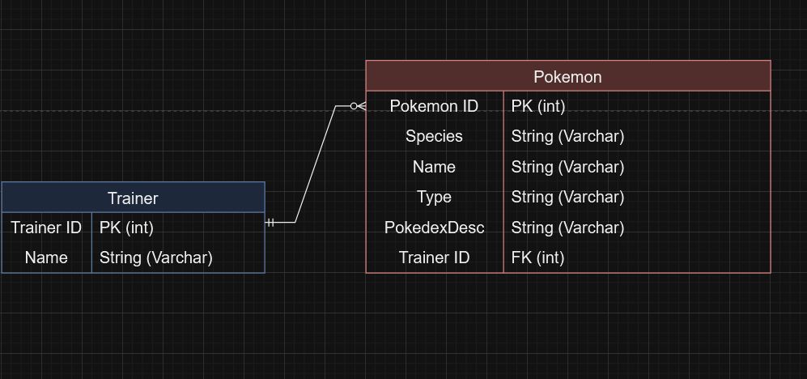

# Pokemon Tracker
This is a back end .NET API to help keep track of trainers and their pokemon teams that will be persisted to a backend. Made by Rohit Rathor.

## Tech Stack

- C# (Back End Programming Language)
- SQL Server (Locally Hosted)
- EF Core (ORM Tech)
- ASP.NET (Web API Framework)

## ERD

## MVP Goals

- User can create a new Trainer.
- User can view all Trainers that exist.
- User can find all Pokemon by their species.
- User can find a Pokemon by it's Nickname.
- User can find all Pokemon filtered by Type.
- User can view a specific Trainer's team of Pokemon.
- User can add or remove Pokemon from a Trainer's team.
- User can remove a Trainer that exists.

## Stretch Goals

- Team size is limited to six pokemon for each trainer.
- Pokemon have pokedex descriptions included.
